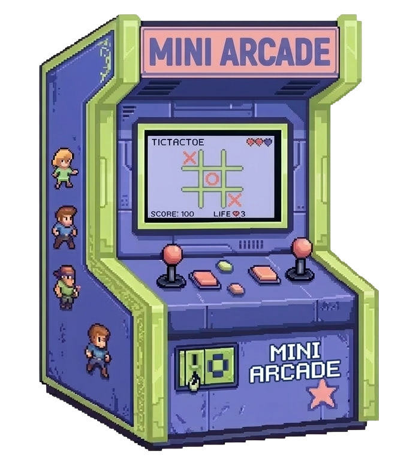
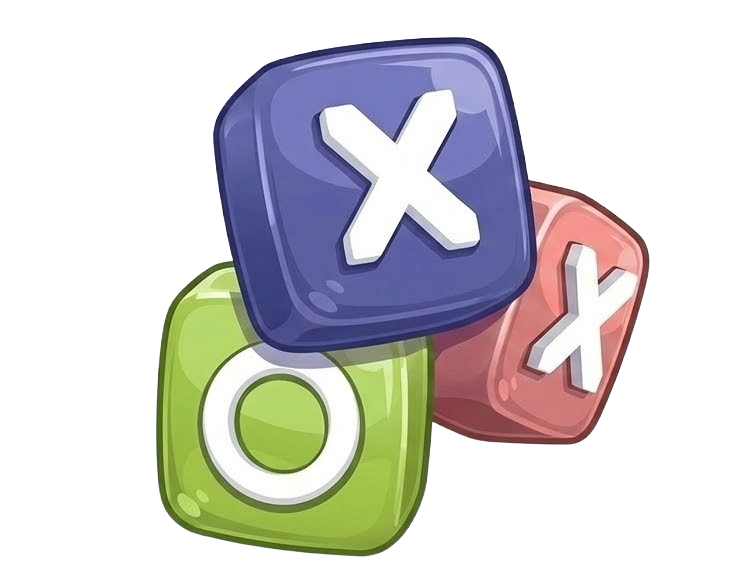

<p align="center">
  
</p>

<h1 align="center">🕹️ Mini Arcade</h1>
<p align="center"><em>A pocket-sized collection of browser games — play instantly, no downloads required.</em></p>

---

## ✨ Features

- 🎠 **Animated game carousel** — GSAP-powered slide transitions between games
- 🎨 **Per-game color theming** — header and nav buttons update dynamically per game
- 🌊 **Wave ripple nav buttons** — pulsing CSS animation on arrow buttons
- 📱 **Fully responsive** — tuned from 4K down to 360px screens

---

## 🎮 Games Included

| Logo | Game | Description |
|------|------|-------------|
|  | **Tic Tac Toe** | Classic two-player X and O strategy game |
|  | **Color Guessing** | Guess the correct color from its RGB value |
|  | **Word Scramble** | Unscramble the jumbled letters to find the word |

---

## 🛠️ Tech Stack


---

## 🚀 Getting Started

```bash
git clone https://github.com/colelezzz/gamedev.git
cd gamedev
```

Then just open `index.html` in your browser — no installs needed!

---

## 📁 Project Structure (for now)

```
mini-arcade/
├── index.html
├── style.css
├── script.js
├── images/
│   ├── logo.png
│   ├── sample.png        # Tic Tac Toe art
│   ├── sample1.png       # Color Guessing art
│   └── sample2.png       # Word Scramble art
├── tictactoe/
├── colorguessing/
└── wordscramble/
```

---

## 📸 Screenshots

> `[ Add screenshot here ]`

---

## 🔮 Future Improvements

- [ ] Local leaderboard via `localStorage`
- [ ] Touch/swipe support for mobile carousel
- [ ] More games — Snake, Memory Match, Reaction Timer
- [ ] Keyboard arrow navigation

---

## 👤 Author

**Developed by:** `Coleen Isles`  
**GitHub:** [@colelezzz](https://github.com/colelezzz)  
**Live Demo:** `[yet to come]`

---

<p align="center">Built as an OJT project with ☕ and a love for fun games.</p>